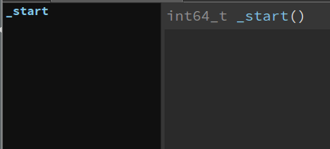
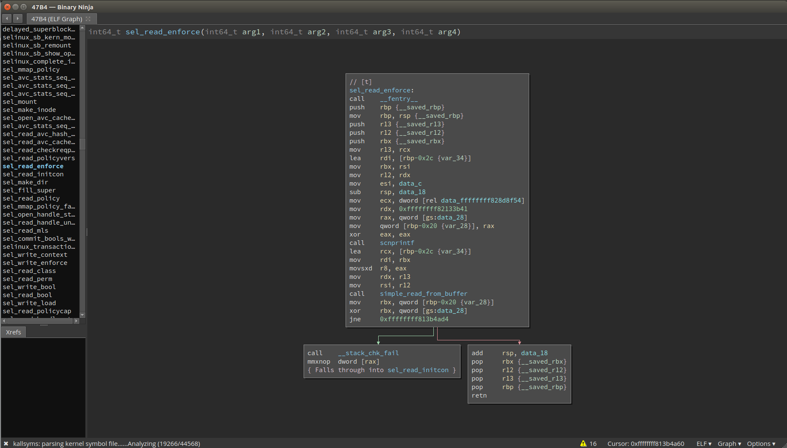

# kallsyms
Author: **zznop**

_Binary Ninja plugin for importing symbols to a kernel binary from /proc/kallsyms_

## Description:

bn-kallsyms allows you to open a file containing kernel symbols (generated with `cat /proc/kallsyms > out.txt`) from
inside the Binary Ninja UI to import symbol infromation and aid in kernel RE.

**Before loading kernel symbols:**



**After loading kernel symbols:**



## Minimum Version

This plugin requires the following minimum version of Binary Ninja:

 * release - 1.1.1142
 * dev - 1.1.1228-dev

## License

This plugin is released under a [MIT](LICENSE) license.

## Usage

## Generating a kallsyms file

To generate a kallsyms file, simply run the following command:
```
sudo sh -c "echo 0  > /proc/sys/kernel/kptr_restrict" && sudo cat /proc/kallsyms > kallsyms.txt
```

## Loading kallsyms

To use this plugin, you must first extract the compressed kernel image from the boot image. To do this, use binwalk:

```
$ binwalk -e vmlinuz-4.13.0-43-generic
```

This should create a sub-directory containing the decompressed kernel image:

```
$ file ~/_vmlinuz-4.13.0-43-generic.extracted/47B4 
/home/joe/_vmlinuz-4.13.0-43-generic.extracted/47B4: ELF 64-bit LSB executable, x86-64, version 1 (SYSV), statically linked, BuildID[sha1]=3e0dc1c8b93e2f3f522a596cfc4b482065469041, stripped
```

Load the kernel binary into Binary Ninja. Then, click `Tools->"kallsyms: Apply kernel symbols". You will then be
prompted to select the `/proc/kallsyms` output file. Select it, and click "Open". The plugin will proceed to parse
the kallsyms file, create functions, and import symbol names into the database.
